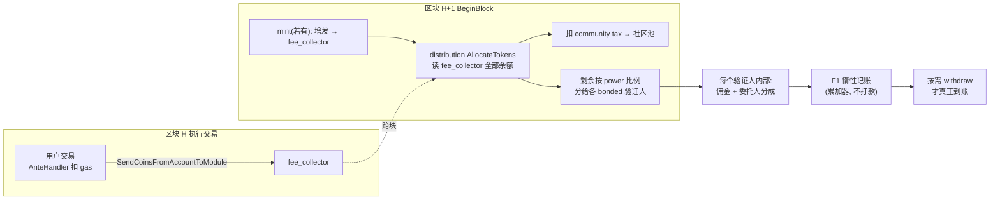
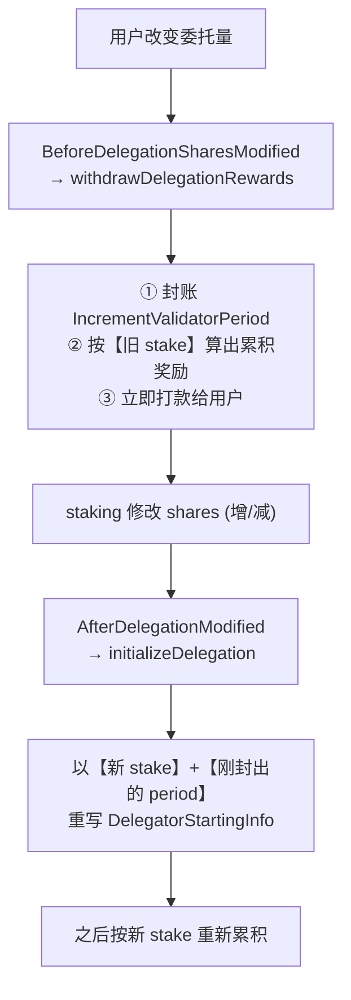
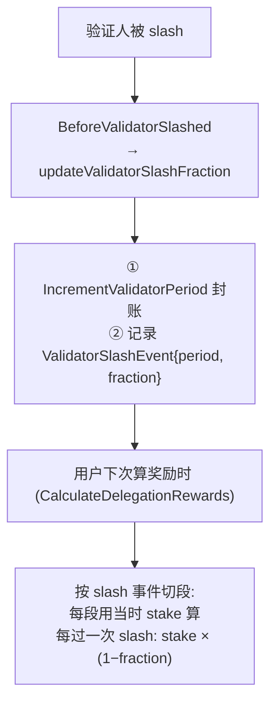

# Gas / 通胀奖励分发机制

> 本文整理当前链上手续费（gas fee）与通胀奖励的分发机制，并重点说明**质押发生变化时，质押奖励是如何变化的**。作为后续设计「质押奖励模块」的评审基线。

## 一、整体数据流（从收费到到账）



四个阶段：

1. **收集**：gas fee 在交易执行时（区块 H）由 ante handler 扣走，进 `fee_collector`（`x/auth/ante/fee.go:135`，`SendCoinsFromAccountToModule(..., FeeCollectorName, fees)`）。
2. **搬运 + 一级分配**：下一区块 BeginBlock，`AllocateTokens` 读走 `fee_collector` 全部余额 → 扣社区税 → 剩余按各验证人 power 占比分配（`x/distribution/keeper/allocation.go:50-80`）。本版本**无 proposer bonus**，纯按 power 比例。
3. **二级分配（验证人内部）**：每个验证人按佣金率拆成 `commission`（归验证人）和 `shared`（归全体委托人），都只更新累加器，不转账（`allocation.go:85-142`）。
4. **惰性结算**：奖励留在 distribution 模块账户，用 F1 算法按需计算，委托人/验证人主动 `withdraw` 或委托变动时才真正打款。

> 时序要点：第 H 块的 gas fee 在第 H+1 块的 BeginBlock 才分配，存在**一个区块的延迟**；分配对象是上一区块有投票的验证人集合（`bondedVotes`）。

## 二、F1 记账的核心（理解「质押变化」的前提）

每个验证人维护一条按 **period（周期）** 切分的「**累计每股奖励** `CumulativeRewardRatio`」，含义是「从创建到某周期，每 1 个 token 累计能分到多少奖励」。委托人奖励的核心公式：

```
某委托奖励 = (终点周期累计 − 起点周期累计) × stake
```

每个委托存一条 `DelegatorStartingInfo{起点 period, stake, height}`。该公式成立的**前提是这段时间 stake 不变**——因此任何改变 stake 的事件，都必须「切一刀」结束当前周期、开启新周期。

相关代码：

- 计算：`x/distribution/keeper/delegation.go:48-84`（`calculateDelegationRewardsBetween`）。
- 封账 / 推进周期：`x/distribution/keeper/validator.go:44-117`（`IncrementValidatorPeriod`）。

## 三、重点：质押变化时奖励如何变化

所有变化都通过 staking 触发 distribution 的 hook 实现（`x/distribution/keeper/hooks.go`）。按场景分两类。

### 场景 A：用户主动增 / 减质押（Delegate 追加 / Undelegate 部分 / Redelegate）



关键代码（`x/distribution/keeper/hooks.go:136-157`）：

```go
func (h Hooks) BeforeDelegationSharesModified(ctx context.Context, delAddr sdk.AccAddress, valAddr sdk.ValAddress) error {
	// ...
	if _, err := h.k.withdrawDelegationRewards(ctx, val, del); err != nil {
		return err
	}
	return nil
}

// create new delegation period record
func (h Hooks) AfterDelegationModified(ctx context.Context, delAddr sdk.AccAddress, valAddr sdk.ValAddress) error {
	return h.k.initializeDelegation(ctx, valAddr, delAddr)
}
```

**规律**：每次增减质押，会先把到此刻为止的奖励**按旧 stake 全额结算并打款**，再以新 stake 为起点重新计。绝不会出现「前半段 stake=10、后半段 stake=15 混在一段里算」。

> 首次委托走 `BeforeDelegationCreated`，只封账不结算（无旧奖励可领）。

#### 数字例子（无 slash，中途追加）

设 `R(2)=1.0`、`R(4)=1.3`、`R(6)=1.7`；period 2 委托 10，period 4 追加到 15，period 6 领奖：

- 追加时自动结算：`(1.3 − 1.0) × 10 = 3` → 立即到账，起点重置为 `(period 4, stake 15)`。
- 领奖时：`(1.7 − 1.3) × 15 = 6`。
- 合计 `9`。

### 场景 B：被动质押变化——验证人被 slash

slash 不结算、不打款，但会**记录一个 slash 事件**并在后续计算时切段：



计算时的切段逻辑（`x/distribution/keeper/delegation.go:126-144`）：

```go
k.IterateValidatorSlashEventsBetween(ctx, valAddr, startingHeight, endingHeight,
	func(height uint64, event types.ValidatorSlashEvent) (stop bool) {
		endingPeriod := event.ValidatorPeriod
		if endingPeriod > startingPeriod {
			delRewards, err := k.calculateDelegationRewardsBetween(ctx, val, startingPeriod, endingPeriod, stake)
			// ...
			rewards = rewards.Add(delRewards...)
			stake = stake.MulTruncate(math.LegacyOneDec().Sub(event.Fraction))
			startingPeriod = endingPeriod
		}
		return false
	},
)
```

#### 数字例子（slash 20%）

设 `R(2)=1.0`、`R(4)=1.3`（slash）、`R(6)=1.7`；委托 10：

- 段①：`(1.3 − 1.0) × 10 = 3`；slash 后 `stake = 10 × 0.8 = 8`。
- 段②：`(1.7 − 1.3) × 8 = 3.2`。
- 合计 `6.2`。

## 四、两类变化对比

| 维度 | 增 / 减质押（场景 A） | 被 slash（场景 B） |
|---|---|---|
| 触发 hook | `BeforeDelegationSharesModified` + `AfterDelegationModified` | `BeforeValidatorSlashed` |
| 是否结算打款 | **是**，按旧 stake 立即结算到账 | 否，只记事件，下次算时切段 |
| period 处理 | 封账 + 重置 startingInfo（新 stake） | 封账 + 记 slash 事件 |
| stake 后续 | 用新 stake 累积 | 计算时按 `1 − fraction` 缩减 |
| 谁触发 | 委托人自己 | slashing 模块（验证人作恶/掉线） |

## 五、小结

- **现有机制**：fee（+通胀）→ `fee_collector` → 下一块 `AllocateTokens` 按 power 一级分配 → 验证人内按佣金二级拆分 → F1 惰性记账 → 按需领取。
- **质押变化的统一原则**：任何破坏「stake 恒定」假设的事件都会成为一个 **period 边界**。
  - 主动增减质押会**额外触发立即结算打款**，再以新 stake 起算；
  - slash 则只切段、按比例缩减 stake，不打款。
- 这样保证无论中途如何变化，每个委托人始终只对「自己实际有效 stake × 对应那段每股奖励」拿到精确奖励。

## 相关代码索引

| 功能 | 文件 |
|---|---|
| gas fee 扣除入 fee_collector | `x/auth/ante/fee.go` |
| fee_collector → distribution 搬运 + 一级分配 | `x/distribution/keeper/allocation.go` (`AllocateTokens`) |
| 分配触发时机 | `x/distribution/abci.go` (`BeginBlocker`) |
| 通胀增发入 fee_collector | `x/mint/abci.go` |
| F1 奖励计算 | `x/distribution/keeper/delegation.go` |
| period 累加器维护 | `x/distribution/keeper/validator.go` |
| 质押变化 / slash 的 hook | `x/distribution/keeper/hooks.go` |
