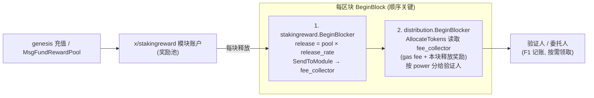

# 质押奖励模块（x/stakingreward）设计方案（初稿）

> 背景：当前链**无通胀**。为持续激励质押用户，引入一个独立的「质押奖励模块」：预先把一笔原生 token 充值到模块账户，按「释放比例」逐块释放，并在 gas fee 分发时按各验证人质押权重（power）一并分配给质押用户。
>
> 本文关联文档：[Gas / 通胀奖励分发机制](./gas-inflation-reward-distribution.md)（现有机制基线）。

## 一、为什么不用 EVM 预编译（precompile）实现

本链带 EVM 模块，一个自然的想法是「用预编译合约 + 合约内分发」来做质押奖励。经评估**不采用**该方案，原因如下：

### 1. EVM 预编译的质押通道，底层仍然是原生 staking 模块

EVM 预编译只是把调用代理到原生 `x/staking`。也就是说**存在两条质押入口**：原生交易（`MsgDelegate` 等）和 EVM 预编译。如果把质押奖励逻辑放进合约：

- 用户若通过**原生交易**质押，合约**无法感知**这次质押的发生；
- 合约维护的「谁质押了多少」状态会与链上真实质押状态脱节，导致奖励发放错误。

### 2. 质押量变化时合约无法完整感知，无法精确结算「前一段」奖励

奖励的精确计算依赖「质押量变化时立即结算上一段奖励」（见基线文档的 F1 机制：增减质押会触发 `BeforeDelegationSharesModified` → 先按旧 stake 结算）。但由于**存在原生质押路径**，合约无法捕获所有质押量变更事件：

- 当质押量在合约视野之外发生改变时，合约**无法切出正确的结算分段**；
- 结果是无法还原「变更前那一段、按当时有效 stake 应得的奖励」，奖励计算不准确。

### 3. 分发逻辑复杂，合约内计算 gas 成本高；而 distribution 已有精细实现可复用

质押奖励的精确分发（period 累加器、slash 切段、佣金二级拆分、惰性结算）逻辑复杂：

- 在合约里实现这套逻辑**消耗 gas 很高**，且难以保证与原生分发一致；
- `x/distribution` 已有设计精细、经过验证的 F1 奖励分发机制，**可以直接复用**。把释放出的奖励并入现有分发管线，既准确又省成本。

**结论**：在原生模块层（`x/stakingreward`）实现，把释放的奖励交给 `x/distribution` 按既有逻辑分发，是正确、低成本、可复用的方案。

## 二、核心思路

让新模块的 `BeginBlocker` 排在 `distribution` 之前，每块从奖励池释放一笔到 `fee_collector`，其余分配逻辑（按 power 比例分给验证人、F1 记账）完全复用现有 distribution 模块——**对 distribution / staking 业务逻辑零侵入**。这与现有 `mint` 把增发币打入 `fee_collector` 的模式完全一致（见 `x/mint/abci.go`）。




## 三、关键决策点


| #   | 决策点                     | 选项                                                                               | 推荐                           |
| --- | ----------------------- | -------------------------------------------------------------------------------- | ---------------------------- |
| Q1  | 释放节奏                    | A. 每块固定数量 `reward_per_block`；B. 按池余额比例 `release_rate`（几何衰减）；C. 年化率 ÷ 区块数（仿 mint） | **B**（贴合「释放比例」语义，池永不清零、曲线平滑） |
| Q2  | 释放奖励是否也被抽 community tax | A. 走 `fee_collector`，会被抽税（零侵入）；B. 绕过税，全额给质押者（需给 distribution 加 keeper 方法）        | 看产品意图，默认 **A**               |
| Q3  | 池枯竭后行为                  | 自动停发 + 发事件告警                                                                     | 停发 + 事件                      |


## 四、模块设计 `x/stakingreward`

### 4.1 模块账户

- 账户名 `stakingreward`，**无 minter 权限**（不增发，钱来自预充值），契合「无通胀」前提。
- 加入 `blockAccAddrs`（禁止用户直接转入，统一走 genesis 或 `MsgFundRewardPool`）。

### 4.2 参数（proto `Params`）

```proto
message Params {
  string reward_denom  = 1;  // 原生 token denom
  // 每块释放比例（占当前池余额的比例），Q1-B
  string release_rate  = 2 [(gogoproto.customtype) = "cosmossdk.io/math.LegacyDec"];
  bool   enabled       = 3;
}
```

> 选 Q1-A 则换成 `cosmossdk.io/math.Int reward_per_block`；选 Q1-C 则加 `blocks_per_year`。

### 4.3 状态

- 仅存 `Params`。池余额直接用 `bankKeeper.GetBalance(poolAddr, denom)` 读取，**不重复记账**（单一真相源，避免双账本不一致）。
- 可选 `TotalReleased` 累计值，仅用于可观测性。

### 4.4 BeginBlocker（核心，确定性实现）

```go
// x/stakingreward/keeper/abci.go (草图)
func (k Keeper) BeginBlocker(ctx context.Context) error {
    params, err := k.GetParams(ctx)
    if err != nil || !params.Enabled {
        return err
    }

    poolAddr := k.authKeeper.GetModuleAddress(types.ModuleName)
    balance := k.bankKeeper.GetBalance(ctx, poolAddr, params.RewardDenom)
    if balance.IsZero() {
        return nil // 池枯竭，自动停发
    }

    // Q1-B: release = floor(balance * release_rate)
    release := math.LegacyNewDecFromInt(balance.Amount).
        MulTruncate(params.ReleaseRate).TruncateInt()
    if release.IsZero() {
        return nil
    }
    if release.GT(balance.Amount) { // 防御
        release = balance.Amount
    }

    coins := sdk.NewCoins(sdk.NewCoin(params.RewardDenom, release))
    // Q2-A: 打进 fee_collector，复用 distribution 分配
    if err := k.bankKeeper.SendCoinsFromModuleToModule(
        ctx, types.ModuleName, k.feeCollectorName, coins); err != nil {
        return err
    }

    sdk.UnwrapSDKContext(ctx).EventManager().EmitEvent(
        sdk.NewEvent(types.EventTypeRelease,
            sdk.NewAttribute(sdk.AttributeKeyAmount, coins.String()),
            sdk.NewAttribute(types.AttributeKeyRemaining, balance.Amount.Sub(release).String()),
        ),
    )
    return nil
}
```

确定性检查：无浮点、无 map 迭代、`MulTruncate`/`TruncateInt` 向下取整、对余额 cap——满足共识路径要求。

### 4.5 Msg / Query

- `MsgUpdateParams`（gov authority 门控，仿 `x/staking` 的 `UpdateParams`）。
- `MsgFundRewardPool`（任何人可注资，`SendCoinsFromAccountToModule`）——方便补仓。
- Query：`Params`、`Pool`（余额 + 预计可发放区块数）。

### 4.6 Genesis

- `Params` + 充值方式：推荐复用 bank genesis 给模块账户地址直接配初始余额。

## 五、集成改动点（最小 diff）

仅动 app 装配，**不改 distribution / staking 业务逻辑**（Q2-A 前提下）。`simapp/app_config.go`（真实链 app 同理）：

```go
// 1) 模块账户权限：无 minter
moduleAccPerms = []*authmodulev1.ModuleAccountPermission{
    // ...
    {Account: stakingrewardtypes.ModuleName},
}

// 2) 禁止外部直接转入
blockAccAddrs = []string{ /* ... */ stakingrewardtypes.ModuleName }

// 3) BeginBlocker 顺序：stakingreward 必须在 distribution 之前
BeginBlockers: []string{
    minttypes.ModuleName,
    stakingrewardtypes.ModuleName,   // 新增，在 distr 之前
    distrtypes.ModuleName,
    slashingtypes.ModuleName,
    // ...
}

// 4) InitGenesis 顺序：在 distribution 之前、bank 之后
```

依赖：keeper 依赖 `AccountKeeper`（取模块地址）、`BankKeeper`（转账/查余额）、`feeCollectorName`；**不依赖 staking/distribution keeper**（Q2-A），耦合度最低。

## 六、Q2-B 备选（绕过 community tax，全额给质押者）

若释放奖励不想被社区税抽走，则不走 `fee_collector`，改为给 `distribution` 加一个 keeper 方法按 power 直接分配：

```go
// x/distribution/keeper/allocation.go 新增（草图）
func (k Keeper) AllocateTokensToValidatorsByPower(
    ctx context.Context, totalPower int64, votes []abci.VoteInfo, tokens sdk.DecCoins,
) error {
    // 复用 AllocateTokens 的 powerFraction 循环，但不扣 communityTax
}
```

然后 `stakingreward.BeginBlocker` 调它。代价：引入对 distribution keeper 的依赖 + 改 distribution 代码（需配套测试）。

## 七、风险 / 边界

- **顺序依赖**：`stakingreward` 必须在 `distribution` 之前，否则当块释放延迟一块。需在文档与测试中固化。
- **community tax 重复抽取**（Q2-A）：释放奖励会被再抽一次社区税，需向产品确认是否接受。
- `**totalPreviousPower == 0`**：distribution 在无投票时会把 fee_collector 余额转入社区池（`allocation.go:38-41`）——链刚启动/无人出块时，释放奖励会进社区池而非质押者。
- **池枯竭**：自动停发并发事件，建议配监控告警。
- **参数校验**：`release_rate ∈ (0,1]`、`reward_denom` 合法、`enabled` 切换。
- **迁移/升级**：新增模块需走 upgrade handler 注册 store key + 初始化 params + 注资。

## 八、测试（强制）

- **单元**：BeginBlocker 释放额计算（含 cap、零余额、`enabled=false`）、参数校验、gov `UpdateParams` 鉴权、`MsgFundRewardPool`。
- **集成**：跨模块——释放后经 distribution 按 power 落到验证人 outstanding rewards，端到端校验金额；与 gas fee 同块分发的合并行为。

## 九、增量交付计划

1. proto（params/msg/query/genesis/events）+ 生成代码。
2. types（params 校验、keys、errors、event 常量）+ 单测。
3. keeper（params CRUD、BeginBlocker、msg server）+ 单测。
4. module.go + depinject 接线 + genesis。
5. app_config 集成 + 集成测试。
6. （可选）Q2-B 的 distribution 改动。

## 十、待确认

- Q1 / Q2 / Q3 三个决策点取值。
- 模块落地位置：当前 cosmos-sdk fork（`x/stakingreward`）还是上层链 app 仓库——决定 proto 包路径与接线位置。

